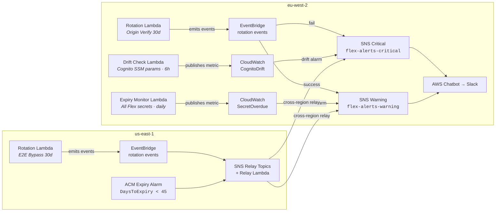
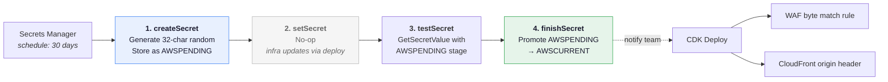
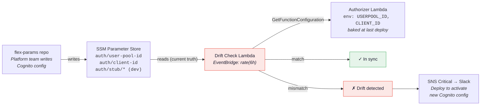
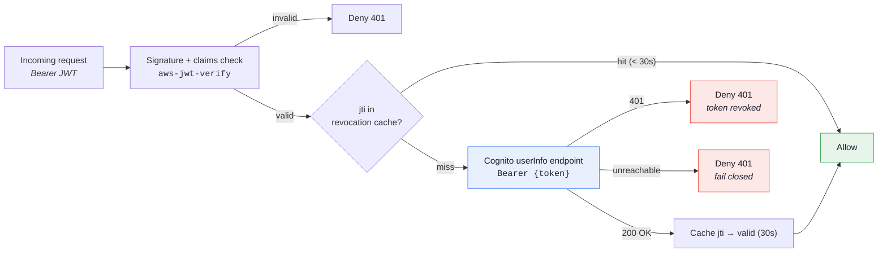

# Credential Lifecycle Architecture

Architecture diagrams for FLEX-404 implementation review.

---

## 1. Alerting Topology

Three monitoring mechanisms in eu-west-2 plus rotation and ACM alerting in us-east-1, all funnelling through the existing SNS → Chatbot → Slack pipeline.

### Alert severity mapping

| Severity | Triggers |
|----------|----------|
| **CRITICAL** | Rotation failure, Cognito drift detected |
| **WARNING** | Rotation success (deploy needed), secret overdue, ACM < 45 days |

---

## 2. Secret Rotation Protocol

Both infrastructure secrets (Origin Verify, E2E Bypass) use the same 4-step Secrets Manager rotation protocol. `setSecret` is a no-op because WAF rules and CloudFront headers resolve `secretValue.unsafeUnwrap()` at deploy time, not runtime.

> **Why setSecret is a no-op:** WAF rules and CloudFront custom headers resolve `secretValue.unsafeUnwrap()` at CDK synth time. The value is baked into the CloudFormation template. Rotating the secret in Secrets Manager updates `AWSCURRENT`, but the infrastructure still serves the old value until the next deployment.

---

## 3. Cognito Config Drift Detection

If Platform team updates Cognito config in `flex-params` but Flex hasn't deployed, the authorizer Lambda runs with stale values. The drift check catches this within 6 hours — before users hit auth failures.

---

## 4. Authoriser Token Revocation Flow

The authoriser validates JWT signature and claims via `aws-jwt-verify`, then verifies the token has not been revoked by calling the Cognito `userInfo` endpoint. A short-lived in-memory cache (30s TTL, keyed by `jti`) avoids calling Cognito on every request for the same token.

When `GlobalSignOut` or `RevokeToken` is called in Cognito during incident response, the authoriser rejects the revoked token within at most 30 seconds (cache expiry).

---

## 5. Credential Coverage Matrix

Every credential type from the AC, showing which lifecycle mechanism covers it.

| Credential | Auto-rotate | Expiry alert | Drift detect | Revocation | Mechanism |
|------------|:-----------:|:------------:|:------------:|:----------:|-----------|
| Origin Verify Secret | ✅ | ✅ | — | — | Rotation Lambda 30d + EventBridge fail alert |
| E2E Bypass Secret | ✅ | ✅ | — | — | Rotation Lambda 30d + EventBridge fail alert |
| DVLA / UDP / UNS configs | — | ✅ | — | — | Expiry monitor checks `LastRotatedDate` (90d) |
| E2E / Smoke test secrets | — | ✅ | — | — | Expiry monitor checks `LastRotatedDate` (90d) |
| Cognito JWT keys | ✅ | ✅ | — | — | AWS auto-rotates; `aws-jwt-verify` refetches on `kid` miss |
| Cognito access tokens | — | — | — | ✅ | Authoriser checks Cognito `userInfo` on each request (30s cache) |
| Cognito User Pool / Client ID | — | — | ✅ | — | Drift check: SSM vs deployed env vars every 6h |
| ACM certificate | ✅ | ✅ | — | — | AWS auto-renews; CW alarm on `DaysToExpiry < 45` |
| SONAR_TOKEN_FLEX | — | ⚠️ | — | — | Calendar reminder (180d); no API for auto-detection |
| OIDC roles / STS / GITHUB_TOKEN | ✅ | — | — | — | Short-lived / per-request — no monitoring needed |

**Legend:** ✅ Covered (automated) · ⚠️ Covered (manual tracking) · — Not applicable

---

## Implementation Components

| Component | New/Modify | Region | Purpose |
|-----------|-----------|--------|---------|
| Rotation Lambda | New | eu-west-2 + us-east-1 | 4-step rotation for random-string secrets |
| Expiry Monitor Lambda | New | eu-west-2 | Daily `LastRotatedDate` check on all Flex secrets |
| Drift Check Lambda | New | eu-west-2 | 6-hourly SSM vs authoriser env var comparison |
| Token revocation check | Modify auth-service.ts | eu-west-2 | Cognito userInfo check + 30s revocation cache |
| `SecretRotationAlarms` construct | New | Both | EventBridge rules for rotation success/failure |
| ACM expiry alarm | Modify global.ts | us-east-1 | CloudWatch `DaysToExpiry < 45` |
| Rotation schedules | Modify platform.ts + global.ts | Both | `addRotationSchedule` on infrastructure secrets |
