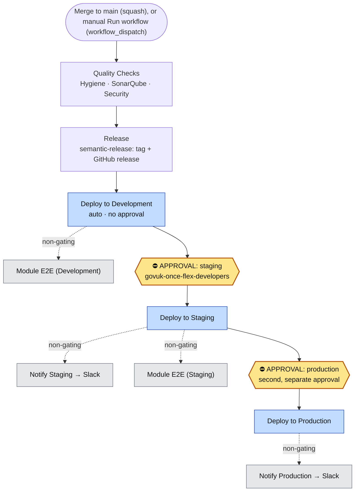
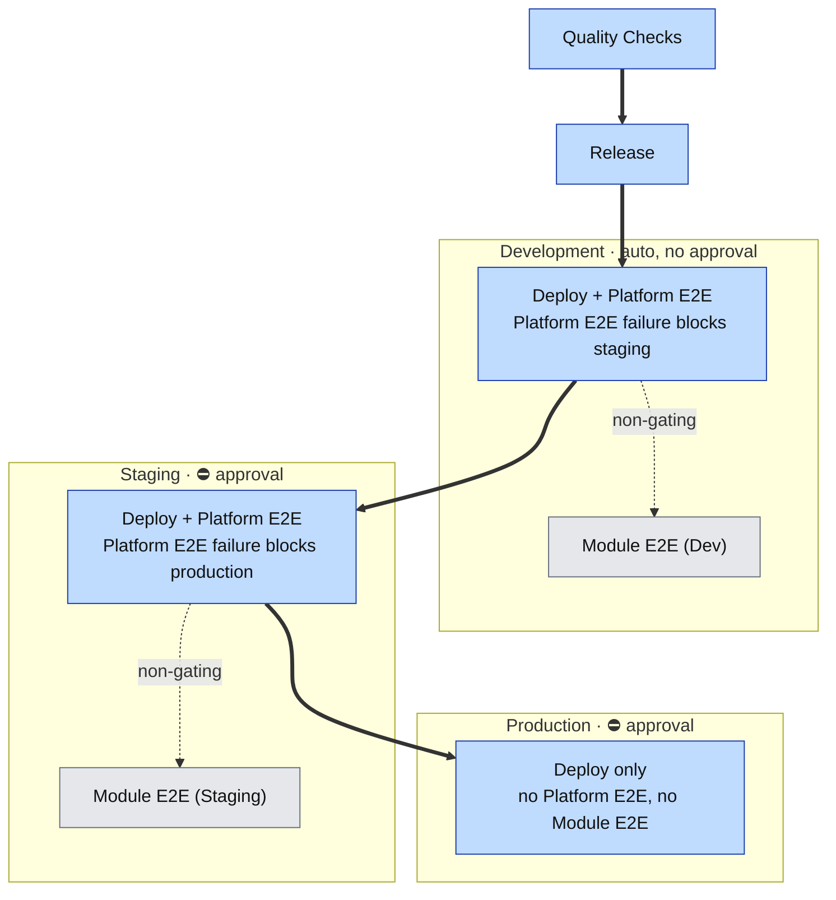

# Runbook: Promoting a Change Through the Pipeline

Operational runbook for taking a change from `main` to production through the FLEX
Continuous Deployment pipeline, and for responding when a promotion stalls or fails.

This runbook is written for an engineer who has **not** driven the pipeline before,
including on-call. It assumes no prior knowledge beyond having repository access and
membership of the `govuk-once-flex-developers` GitHub team.

For the underlying design (environments, stacks, manual/hotswap deploys) see the
[Deployment Guide](/docs/deployment.md). For versioning and release notes see
[Releases and Versioning](/docs/releases.md). This runbook focuses on **operating**
the promotion, not on the architecture.

---

## 1. At a glance



> Solid arrows are the gating promotion path; dotted arrows are non-gating side jobs
> (notifications and Module E2E); ⛔ marks a manual approval gate.
>
> **Rendering:** these diagrams use Mermaid, which GitHub renders natively. In Confluence,
> paste the same fenced blocks into the **Mermaid** macro (or a Mermaid plugin) so they
> render there too.

| You need to… | Go to |
| --- | --- |
| Watch a promotion | GitHub → **Actions** → **Continuous Deployment** → the run for your merge |
| Approve staging or production | The run page → **Review deployments** button → tick the environment → **Approve and deploy** |
| Start a promotion by hand | Actions → Continuous Deployment → **Run workflow** (branch `main`), or `gh workflow run main.yml` |
| Re-run only what failed | The run page → **Re-run failed jobs**, or `gh run rerun <run-id> --failed` |
| See what deployed to staging/production | `#govuk-once-flex-release` Slack channel |

**Source of truth:** [`.github/workflows/main.yml`](/.github/workflows/main.yml). If this
runbook and that file ever disagree, the workflow wins — raise a change to fix the runbook.

---

## 2. How a change enters the pipeline

There are two entry points, both on the `main` branch only (enforced by each
environment's branch policy).

### 2.1 Automatic: merge to `main`

A pull request is **squash-merged** into `main`. The squash-commit subject (the PR
title) drives the version bump, so it must follow the commit convention described in
[Releases and Versioning](/docs/releases.md). The push to `main` triggers the
**Continuous Deployment** workflow automatically. This is the normal path.

### 2.2 Manual: `workflow_dispatch`

The workflow also declares `workflow_dispatch`, so it can be started by hand against the
current tip of `main` without a new merge. Use this to re-drive a promotion after a
transient failure, or to promote the current `main` if an earlier run was cancelled.

- **UI:** Actions → **Continuous Deployment** → **Run workflow** → branch `main` → **Run workflow**.
- **CLI:** `gh workflow run main.yml --ref main`.

A manual dispatch runs the **whole** pipeline from Quality Checks again. `semantic-release`
is idempotent: if there are no new releasable commits since the last tag, no new tag or
release is created and the deploy stages still run against the current code.

### 2.3 Re-running an existing run

If a run failed at a deploy stage and the cause was transient (for example a throttled
AWS call), you do not need a new commit:

- **Re-run failed jobs only** (keeps the successful stages): run page → **Re-run failed
  jobs**, or `gh run rerun <run-id> --failed`.
- **Re-run everything:** run page → **Re-run all jobs**, or `gh run rerun <run-id>`.

CDK deploys are idempotent, so re-running a deploy stage is safe: it converges the stack
to the desired state and no-ops anything already applied.

---

## 3. The full stage sequence and what gates each step

The job graph below is exactly what runs (job names as they appear in the Actions UI).
"Gates the next stage" means the following stage will not start unless this one succeeds.

The diagram below groups the jobs by environment and shows what gates progression. Thick
arrows are the gating promotion path between environments; dotted arrows are non-gating
jobs. Note the split inside each deploy: the in-job **Platform E2E** step gates the next
environment, whereas the separate **Module E2E** job does not (see 3.2). Production runs
neither Platform E2E nor Module E2E. The full `needs:` wiring lives in
[`main.yml`](/.github/workflows/main.yml); the table beneath is the exhaustive view.



| Order | Job (UI name) | Environment / stage | Approval before it runs? | Gates promotion? |
| --- | --- | --- | --- | --- |
| 1 | Quality Checks / Hygiene, SonarQube, Security | `development` creds | No | **Yes** — Release waits on all three |
| 2 | Release | — | No | **Yes** — deploys wait on it |
| 3 | Deploy to Development / buildAndDeploy | `development` | No (no protection) | **Yes** — staging waits on it |
| 4 | Module E2E (Development) | `development` | No | **No** (see 3.2) |
| 5 | Deploy to Staging / buildAndDeploy | `staging` | **Yes — staging approval** | **Yes** — production waits on it |
| 6 | Notify Staging Deployment | — | No | No |
| 7 | Module E2E (Staging) | `staging` | No | **No** (see 3.2) |
| 8 | Deploy to Production / buildAndDeploy | `production` | **Yes — production approval** | End of line |
| 9 | Notify Production Deployment | — | No | No |
| — | Notify Deployment Failure | — | Runs only if a deploy job failed | No |

### 3.1 What actually gates each stage

- **Quality Checks → Release → Deploy to Development** are chained by `needs:`, so each
  waits for the previous to succeed. Development has no environment protection, so it
  deploys as soon as Release finishes.
- **Deploy to Staging** waits on **Deploy to Development succeeding** *and* on the
  **staging approval** (environment protection rule).
- **Deploy to Production** waits on **Deploy to Staging succeeding** *and* on the
  **production approval**. It does **not** wait for staging's notifications or module E2E.
- Inside each deploy job there is a post-deploy **Platform E2E** step
  (`_build-deploy.yml`). Because it runs in the same job as the deploy, a Platform E2E
  failure **fails the deploy job**, which blocks the next stage. Platform E2E runs for
  development and staging only (`if: STAGE != 'production'`) — there is **no** Platform
  E2E against production.

### 3.2 Important: Module E2E does not block promotion

The **Module E2E (Development)** and **Module E2E (Staging)** jobs run per domain
(`udp`, `dvla`, `uns`, `example`) after each deploy, but **no later stage depends on
them**. Consequences to be aware of on-call:

- Production can deploy **before** staging's Module E2E has even finished. In a real
  successful run the "Deploy to Production" job started before the "Module E2E (Staging)"
  jobs ran.
- A **red** Module E2E job does **not** stop the promotion and does **not** trigger the
  failure notification. Treat a Module E2E failure as a signal to investigate, and halt
  the promotion **manually** (section 7) if it points at a real regression — the pipeline
  will not halt itself.

---

## 4. Manual approvals: who, where, and how

Approvals are GitHub **Environment protection rules**, not anything in the repository
code. They are configured under repo **Settings → Environments**.

| Environment | Requires approval? | Who can approve | Branch policy |
| --- | --- | --- | --- |
| `development` | No | — (auto-deploys) | `main` only |
| `staging` | **Yes** | Any member of the **`govuk-once-flex-developers`** team | `main` only |
| `production` | **Yes** | Any member of the **`govuk-once-flex-developers`** team | `main` only |

There is no wait-timer on either gate; the promotion pauses until a human approves.

### How to approve

1. Open the run: Actions → **Continuous Deployment** → your run. A paused run shows
   status **Waiting** and a yellow **Review deployments** button.
2. Click **Review deployments**.
3. Tick the environment being requested (`staging`, then later `production`).
4. Optionally add a comment, then click **Approve and deploy**. To stop it, click
   **Reject** — the deploy job is skipped and the run ends without promoting further.

### What to check before you approve

- **Staging approval:** development deployed cleanly (green "Deploy to Development") and,
  ideally, Module E2E (Development) is green.
- **Production approval:** staging deployed cleanly, Module E2E (Staging) is green, and
  any manual staging verification (section 6) has been done. This is the last gate before
  production — do not approve it to "unblock the queue".

> Staging and production are **two separate approvals**. Approving staging does not
> pre-approve production; the production prompt appears only after the staging deploy has
> finished.

---

## 5. Is it succeeding, stalled, or failed?

| State | What you see | Meaning |
| --- | --- | --- |
| **In progress** | Run status **In progress**; a deploy job shows a spinner | Normal; a CDK deploy takes a few minutes per stage |
| **Stalled at a gate** | Run status **Waiting**; "Deploy to Staging" or "Deploy to Production" is **queued/waiting**; **Review deployments** button present | Not a failure — it is waiting for a human approval (section 4) |
| **Succeeded** | All jobs green; Slack posts "Flex deployed: v&lt;x&gt; to staging" then "…to production" | Change is live in that environment |
| **Failed** | A job is red; run status **failure**; Slack posts "Flex deployment failed: v&lt;x&gt; to &lt;env&gt;" with a link to the run | A stage failed; promotion stopped there (section 7) |

Signals to rely on:

- **GitHub run status** is authoritative: `gh run list --workflow=main.yml -L 5` or the
  Actions tab. A run left in **Waiting** for a long time is almost always an unactioned
  approval, not a hang.
- **Slack `#govuk-once-flex-release`**: success notifications for **staging and
  production** deploys, and a **failure** notification for any failed deploy stage
  (development, staging or production). Development **success** is deliberately silent, so
  "no Slack message" after a merge does not mean it failed — check the run.
- The failure notification is best-effort (`continue-on-error`); absence of a Slack alert
  is not proof of success. Confirm on the run page.

---

## 6. Verifying each environment after promotion

### Automated verification already in the pipeline

- **Development & Staging:** the in-job **Platform E2E** step runs post-deploy and will
  fail the stage if the platform is unhealthy. **Module E2E** then exercises each domain
  (non-gating, but check it is green).
- **Production:** there is **no** automated Platform E2E and **no** Module E2E stage. A
  green "Deploy to Production" job means CloudFormation applied successfully — it does
  **not** prove the running service is healthy. Production therefore needs the manual
  check below.

### Manual verification (any environment)

Confirm the stacks are in a good state and outputs exist (requires credentials for that
account's role):

```bash
aws cloudformation describe-stacks \
  --stack-name ${STAGE}-FlexPlatform \
  --query 'Stacks[0].{Status:StackStatus}' --output table
```

A healthy stack shows `CREATE_COMPLETE` or `UPDATE_COMPLETE`. Anything ending in
`ROLLBACK` or `FAILED` means the deploy did not fully apply.

For production specifically, since the pipeline does not test it, do a lightweight
service check after approving:

- Confirm the expected version reached production from the Slack "…to production"
  notification and the `v<version>` GitHub release.
- Exercise a known-safe read path through the public API / CloudFront distribution and
  confirm a healthy response.
- Watch CloudWatch alarms for the FLEX stacks for a few minutes for new alarm activity.

### Difference in validation: staging vs production

| | Staging | Production |
| --- | --- | --- |
| Platform E2E (in deploy job) | **Yes**, gates the stage | **No** |
| Module E2E (separate job) | **Yes** (non-gating) | **No** |
| Verification is therefore | Largely automated | **Manual** — you must check it |

The practical implication: **staging is where the change is actually tested**. Production
is protected only by the staging results plus the human at the production gate. Do the
staging verification properly before approving production.

---

## 7. When to halt, fix forward, or roll back

### Halt (do not promote further)

Halt when staging verification is bad, a Module E2E failure points at a real regression,
or a defect is spotted before the production gate.

- **At an approval gate:** simply do not approve — click **Reject**, or leave it. Nothing
  reaches the next environment without approval.
- **Mid-run:** **Cancel workflow** on the run page (or `gh run cancel <run-id>`). This
  stops queued stages. Stages already applied are not reverted by cancelling (see below).

### Fix forward (the default response)

FLEX has **no automated "deploy the previous version" rollback**. The normal recovery is
to fix forward:

1. Open a PR with the fix (or a `git revert` of the offending change).
2. Squash-merge to `main` with a correctly-typed title (`fix: …` for a patch).
3. The pipeline runs again; promote it through the gates as usual.

Prefer fix-forward for anything that deployed "successfully" but behaves wrongly, because
CloudFormation considers that stack healthy and will not roll it back on its own.

### What a failed deploy does on its own

If a **CDK/CloudFormation deploy fails mid-apply**, CloudFormation **automatically rolls
that stack back** to its previous template and the deploy job goes red. Because the deploy
runs `cdk deploy --all`, some stacks in that stage may have applied while a later one
failed and rolled back — check each stack's status (section 6) rather than assuming the
whole stage reverted. The next environment is not promoted, because it depends on the
failed job.

### Break-glass manual rollback (last resort)

If production is broken and a fix-forward cannot be prepared quickly, a previous released
version can be re-deployed manually by checking out that tag and deploying with the
production role:

```bash
git checkout v<previous-version>
STAGE=production pnpm deploy    # requires production deploy credentials
```

This is a high-risk, manual action outside the pipeline and its approval gates. Use it
only under incident conditions, announce it in `#govuk-once-flex-release`, and follow up
with a proper fix-forward PR so `main` and production match again.

---

## 8. Diagnosing failures by stage

| Stage fails | Where to look | Common causes | Response |
| --- | --- | --- | --- |
| **Quality Checks** (Hygiene) | Job log: pre-commit / lint / tsc / `validate:integrations` | Lint or type error, secret detected, invalid domain integration route | Fix on a branch, re-merge. Nothing deployed yet |
| **Quality Checks** (SonarQube) | SonarQube scan step + Sonar dashboard | Quality gate failed, unit test failure | Fix and re-merge |
| **Quality Checks** (Security) | Checkov + Dependency Review steps | New IaC finding, high-severity dependency | Fix, or add a justified checkov skip; re-merge |
| **Release** | "Run semantic release" step | Bad commit history, GitHub token/permission issue | Deployment is blocked until fixed; see [Releases troubleshooting](/docs/releases.md#troubleshooting) |
| **Deploy to Development/Staging/Production** | "Deploy FLEX AWS infra" step | CloudFormation error, drift, IAM/OIDC issue, missing SSM param from core stack | Read the CFN error; if transient, **Re-run failed jobs**; if a real infra bug, fix forward. See [Deployment troubleshooting](/docs/deployment.md#troubleshooting) |
| **Platform E2E** (inside a deploy job, dev/staging) | "Platform E2E tests" step in the deploy job | Regression, or stale/missing stack outputs | Investigate the failing assertion; fix forward. This **blocks** the next stage by design |
| **Module E2E (Development/Staging)** | The per-domain matrix job | Domain-level regression, test/data issue | **Non-gating** — the pipeline will not stop. Decide whether to **halt manually** (section 7) |
| **Notify (staging/production/failure)** | Notify job log | SNS/SSM access, missing topic | Cosmetic only (`continue-on-error`); the deploy itself is unaffected |

General approach to any failed stage:

1. Open the failed job, expand the red step, read the actual error (bottom of the log).
2. Decide **transient vs real**. Transient (throttling, runner blip) → re-run failed jobs.
   Real → fix forward.
3. If the failure was at or before a gate, **nothing has been promoted past that gate** —
   there is no urgency to "undo", only to fix and re-drive.

---

## 9. Reference

- **Trigger:** push to `main`, or manual `workflow_dispatch`.
- **Region:** `eu-west-2` (the global/edge stack deploys to `us-east-1` as part of the same CDK app).
- **Deploy command:** `cdk deploy --all --concurrency 4 --require-approval never` (per environment).
- **AWS auth:** OIDC role per environment — `DEV_DEPLOYMENT_ROLE`, `STAGING_DEPLOYMENT_ROLE`, `PROD_DEPLOYMENT_ROLE`. Notifications publish from the **development** account (the release SNS topic lives there).
- **Approver team:** `govuk-once-flex-developers` (staging and production).
- **Slack:** `#govuk-once-flex-release` (deploy + failure notifications).

Workflow files:

- [`main.yml`](/.github/workflows/main.yml) — the Continuous Deployment pipeline (this runbook's subject).
- [`_build-deploy.yml`](/.github/workflows/_build-deploy.yml) — reusable build + deploy + Platform E2E.
- [`_moduleE2E.yml`](/.github/workflows/_moduleE2E.yml) — reusable per-domain E2E (non-gating).
- [`_quality-checks.yml`](/.github/workflows/_quality-checks.yml) — hygiene, SonarQube, security.
- [`_notify-deployment.yml`](/.github/workflows/_notify-deployment.yml) — Slack deploy notifications.

Related docs:

- [Deployment Guide](/docs/deployment.md) — environments, stacks, manual/hotswap deploys.
- [Releases and Versioning](/docs/releases.md) — how a version and release are produced.
- [Release Notifications](/docs/release-notifications.md) — Slack notification mechanism.

---

## Validation against a real run

The stage sequence, the approval behaviour, and the non-gating Module E2E behaviour in
this runbook were checked against real Continuous Deployment runs:

- A run observed **Waiting** at **"Deploy to Staging / buildAndDeploy"** while all
  **Module E2E (Development)** jobs had already completed — confirming the staging
  approval gate and that Module E2E does not gate promotion.
- A fully successful run showed **"Deploy to Production / buildAndDeploy"** starting
  **before** the **"Module E2E (Staging)"** jobs ran — confirming production does not wait
  on staging's Module E2E.
- The `staging` and `production` GitHub Environments both list required-reviewer team
  `govuk-once-flex-developers`; `development` has no protection rule.
